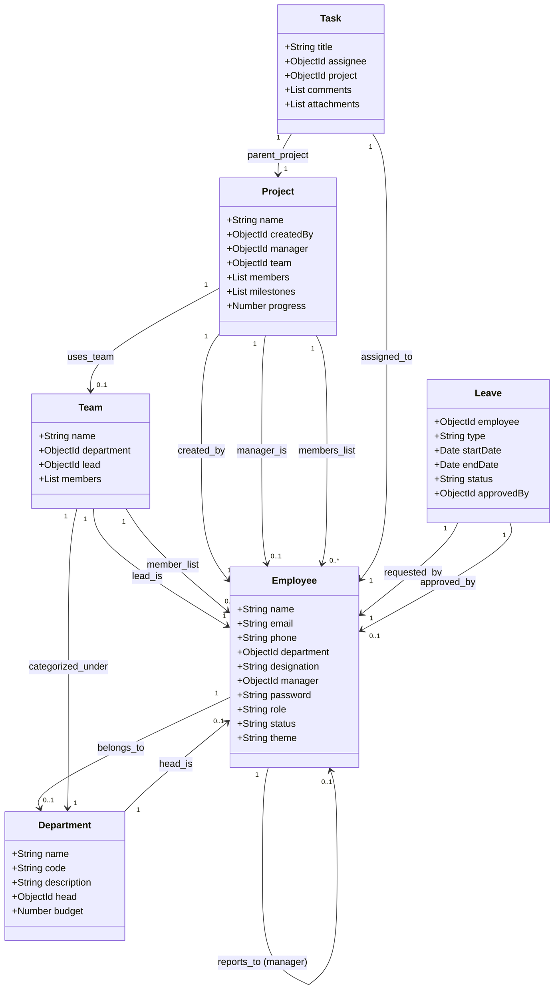
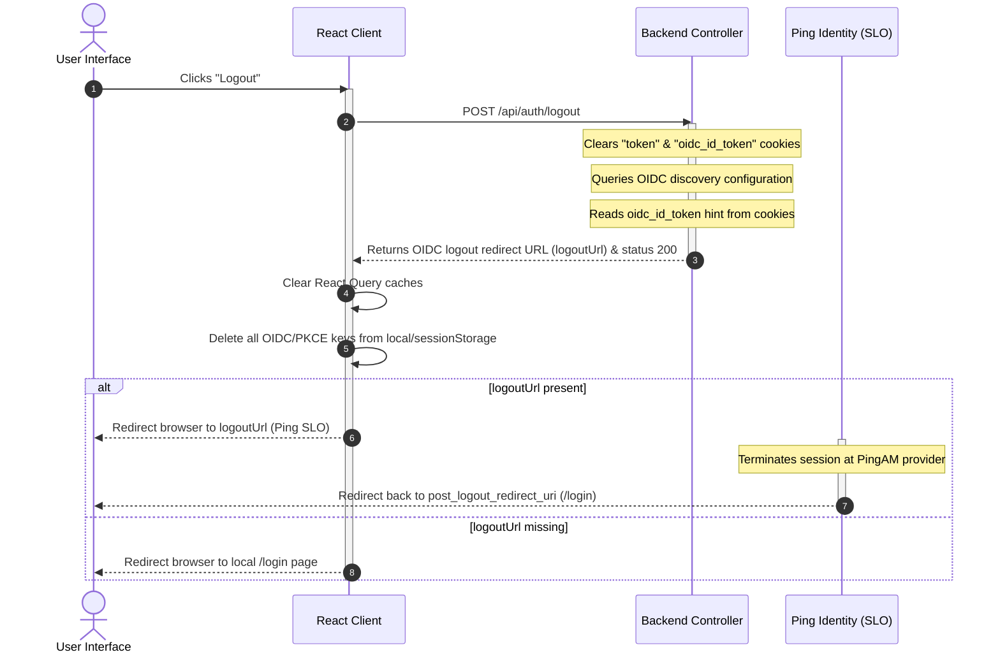

# 🛠️ WorkSphere Project Functionality & Codebase Inventory

This document provides a comprehensive inventory and high-level architectural documentation of the **WorkSphere** platform. It serves as the definitive reference guide for developers, system architects, and onboarding engineers. It is derived directly from the active source code, which serves as the authoritative source of truth.

---

## 📋 Table of Contents
1. [Project Architecture](#1-project-architecture)
2. [Frontend Architecture](#2-frontend-architecture)
3. [Backend Architecture](#3-backend-architecture)
4. [Database Models & Relationships](#4-database-models--relationships)
5. [Authentication & Session System](#5-authentication--session-system)
6. [Authorization & Access Scoping](#6-authorization--access-scoping)
7. [API Documentation Reference](#7-api-documentation-reference)
8. [Environment Variables Config](#8-environment-variables-config)
9. [Third-Party Integrations](#9-third-party-integrations)
10. [End-to-End User Workflows](#10-end-to-end-user-workflows)
11. [Mermaid Sequence Diagrams](#11-mermaid-sequence-diagrams)
12. [Important Files Map](#12-important-files-map)
13. [Current Features Catalog](#13-current-features-catalog)
14. [Limitations & Future Roadmap](#14-limitations--future-roadmap)
15. [Documentation Audit Summary](#15-documentation-audit-summary)

---

## 1. Project Architecture

WorkSphere is structured as a decoupled web application consisting of a modern React Single Page Application (SPA) frontend client and an Express.js REST API server on the backend. Data is stored in a MongoDB database using Mongoose for schema modeling.

### High-Level Components
*   **Frontend SPA**: A Vite-powered React client utilizing React Router v6 for routing, React Context for state management (auth and UI), and Axios for communications.
*   **Backend Server**: A Node.js and Express server mapping REST API routes, executing business services, validating models, and integrating with external OIDC providers.
*   **Database**: MongoDB database that houses persistent records.
*   **Ping Identity Cloud (PingAIC)**: The external Identity Provider (IdP) providing OpenID Connect (OIDC) authentication, Single Sign-On (SSO), registration journeys, and Multi-Factor Authentication (MFA).

### Data Flow & API Communications
1.  **Requests**: React views execute queries or mutations via Axios using the custom instance [apiClient](file:///c:/Users/DELL/OneDrive/Desktop/WorkSphere/client/src/api/client.js) configured with `withCredentials: true`.
2.  **Session Security**: The client communicates session credentials automatically through HttpOnly cookies (`token` and `oidc_id_token`).
3.  **Backend Routes**: Routes are received by the Express entrypoint [app.js](file:///c:/Users/DELL/OneDrive/Desktop/WorkSphere/server/app.js) and passed through safety middleware chains (CORS, Cookie Parser, JSON Body Parsers, Logging).
4.  **Authorization**: Requests are intercepted by authentication and role validation guards in [auth.middleware.js](file:///c:/Users/DELL/OneDrive/Desktop/WorkSphere/server/middleware/auth.middleware.js).
5.  **Controller Delegation**: Once validated, control moves to controllers which translate request parameters and pass clean arguments to dedicated services.
6.  **Business Logic & Persistence**: Backend services in `/server/services` execute operations, invoke Mongoose schema rules, query the MongoDB database, write compliance activity logs, and create notifications.
7.  **Response**: The service results are packaged as JSON payloads by the controller, returned to the Axios client, and parsed to update the React state.

---

## 2. Frontend Architecture

The client application is mounted at `client/src/main.jsx` and runs as a React SPA.

### Routing System
Client routing is managed by React Router v6 in [App.jsx](file:///c:/Users/DELL/OneDrive/Desktop/WorkSphere/client/src/App.jsx). Pages are loaded lazily using `Suspense` and `lazy` imports to minimize loading times. The routes are divided into two main categories using custom routing guards defined in [ProtectedRoute.jsx](file:///c:/Users/DELL/OneDrive/Desktop/WorkSphere/client/src/components/ProtectedRoute.jsx):

1.  **Public & Guest Routes (`<GuestRoute />`)**:
    *   `/login`: Landing screen containing the Ping SSO button and the fallback local credentials form.
    *   `/register`: Page redirecting to Ping Registration or capturing local signup parameters.
    *   `/forgot-password`: Form to submit request for email password recovery links.
    *   `/reset-password/:token`: Captures input for password changes using a hashed URL token.
    *   `/callback`: Endpoint capturing OAuth code and state redirect values from Ping Identity.
2.  **Protected Workspace Routes (`<ProtectedRoute />`)**:
    *   Enforces authentication check. If the user is unauthenticated, they are redirected to `/login` preserving the original route path in `location.state.from`.
    *   Enforces role-based guards. If the active user does not have an allowed role, they are redirected to `/forbidden`.
    *   Renders within [DashboardLayout.jsx](file:///c:/Users/DELL/OneDrive/Desktop/WorkSphere/client/src/layouts/DashboardLayout.jsx) which holds the Sidebar navigation, User Profile greetings, Global Autocomplete Search, and Notification Bell dropdown.

### Global State Management
*   **AuthContext**: Implemented in [AuthContext.jsx](file:///c:/Users/DELL/OneDrive/Desktop/WorkSphere/client/src/context/AuthContext.jsx), it persists user state across reloads by calling `GET /api/auth/me` on mount. It coordinates local login, OIDC login callbacks, and logout operations.
*   **UIContext**: Controls global UI overlays like toasts, edit modal triggers, and loader skeletons.
*   **SearchContext**: Manages state for the global auto-complete search overlay.

### API Services
Frontend HTTP calls are organized in the `client/src/api` directory:
*   [apiClient](file:///c:/Users/DELL/OneDrive/Desktop/WorkSphere/client/src/api/client.js): Configured Axios client that appends base URLs, enables credentials cookie passing, and implements a global response interceptor.
*   **API Interceptor**: Standardizes response formats to return `response.data`. In case of errors, it parses the server's message, logs the exception, and rejects the promise returning a structured error object.

---

## 3. Backend Architecture

The backend server is built on Node.js and Express, configured in [app.js](file:///c:/Users/DELL/OneDrive/Desktop/WorkSphere/server/app.js) and started in [server.js](file:///c:/Users/DELL/OneDrive/Desktop/WorkSphere/server/server.js).

### Express Middleware Chain
For every API call, requests pass through a sequential chain of middlewares:
1.  `cors`: Restricts cross-origin resource sharing to the frontend client URL while allowing credentials.
2.  `cookieParser`: Extracts cookies from request headers, making them available as `req.cookies`.
3.  `express.json` / `express.urlencoded`: Parses incoming JSON and URL-encoded bodies.
4.  `morgan` & `requestLogger`: Logs HTTP request logs to the developer console.
5.  `protect` (selective): Decodes JWT session cookies, fetches Employee profiles, and rejects requests for inactive or suspended users.
6.  `authorize(...roles)` (selective): Restricts access to specific routing handlers based on user roles.

### Decoupled Layer Architecture
*   **Routers**: Located in `/server/routes`, they map endpoints, invoke role verification middlewares, and call controller methods.
*   **Controllers**: Located in `/server/controllers`, they parse parameters from HTTP requests (headers, query strings, cookies, bodies) and pass them to services. Controllers do **not** run queries or compute calculations. They format and return responses with the correct HTTP status codes.
*   **Services**: Located in `/server/services`, they contain the core application business rules. They are decoupled from Express request/response objects, execute database queries via Mongoose, trigger logs, and create notification entries.
*   **Centralized Error Handler**: Placed in [errorHandler.js](file:///c:/Users/DELL/OneDrive/Desktop/WorkSphere/server/middleware/errorHandler.js), it catches unhandled exceptions, writes details to the logger, and sends a JSON response. In development mode, it returns the error stack trace.

---

## 4. Database Models & Relationships

WorkSphere models its data schemas in 11 collections defined under [models](file:///c:/Users/DELL/OneDrive/Desktop/WorkSphere/server/models) using Mongoose.

> [!IMPORTANT]
> **Jobs and Applications Collections**: The codebase does **not** contain any models or collections for `Jobs` or `Applications`. All workforce tasks are tracked as `Task` sub-units assigned to individuals on specific `Project` records. Leave requests are handled via the `Leave` schema.



### Models Inventory

#### 1. Employee
Defined in [Employee.js](file:///c:/Users/DELL/OneDrive/Desktop/WorkSphere/server/models/Employee.js), it represents user accounts.
*   **Fields**: `name` (Required), `email` (Required, unique, lowercase), `phone`, `department` (ObjectId -> Department), `designation` (Default 'Employee'), `manager` (ObjectId -> Employee), `joiningDate` (Date, default now), `address`, `avatar` (URL path), `password` (Hashed, excluded from selections), `role` (enum: Admin, Manager, Team Lead, Employee, default Employee), `status` (enum: Active, Inactive, Suspended, Resigned, On Notice, Archived, default Active), `emergencyContact`, `bio`, `resetPasswordToken`, `resetPasswordExpire`, `theme` (default 'light'), `emailNotifications` (Boolean, true), `pushNotifications` (Boolean, true), `smsAlerts` (Boolean, false).
*   **Hooks**: Pre-save hook hashes plaintext passwords using `bcryptjs` with a salt factor of 10 if modified.
*   **Methods**: `matchPassword(entered)` / `comparePassword(entered)` compare inputs against hashed password using bcrypt.

#### 2. Department
Defined in [Department.js](file:///c:/Users/DELL/OneDrive/Desktop/WorkSphere/server/models/Department.js), it represents structural corporate departments.
*   **Fields**: `name` (Required, unique), `code` (Required, unique, uppercase), `description`, `head` (ObjectId -> Employee), `budget` (Number, default 0).

#### 3. Team
Defined in [Team.js](file:///c:/Users/DELL/OneDrive/Desktop/WorkSphere/server/models/Team.js), it defines sprint and project delivery units.
*   **Fields**: `name` (Required, unique), `description`, `department` (ObjectId -> Department, Required), `lead` (ObjectId -> Employee, Required), `members` (Array of ObjectId -> Employee).

#### 4. Project
Defined in [Project.js](file:///c:/Users/DELL/OneDrive/Desktop/WorkSphere/server/models/Project.js), it tracks corporate initiatives and deliverables.
*   **Fields**: `name` (Required, unique), `description`, `createdBy` (ObjectId -> Employee, Required), `manager` (ObjectId -> Employee), `team` (ObjectId -> Team), `members` (Array of ObjectId -> Employee), `startDate` (Required), `endDate` (Required), `status` (enum: Planning, Active, On Hold, Completed, Archived, default Planning), `priority` (enum: Low, Medium, High, default Medium), `progress` (Number, default 0, min 0, max 100), `milestones` (Array of nested objects: `title` (Required), `dueDate` (Required), `completed` (Boolean, default false)).

#### 5. Task
Defined in [Task.js](file:///c:/Users/DELL/OneDrive/Desktop/WorkSphere/server/models/Task.js), it details specific deliverables.
*   **Fields**: `title` (Required), `description`, `priority` (enum: Low, Medium, High, Urgent, default Medium), `dueDate` (Required), `status` (enum: Todo, In Progress, Review, Done, default Todo), `assignee` (ObjectId -> Employee, Required), `project` (ObjectId -> Project, Required), `labels` (Array of Strings), `comments` (Array of nested schemas: `author` (String, Required), `text` (String, Required), `createdAt`), `attachments` (Array of nested schemas: `name` (String, Required), `url` (String, Required), `size` (Number, Required, bytes)).

#### 6. Leave
Defined in [Leave.js](file:///c:/Users/DELL/OneDrive/Desktop/WorkSphere/server/models/Leave.js), it manages vacation requests and approvals.
*   **Fields**: `employee` (ObjectId -> Employee, Required), `type` (enum: Annual, Sick, Maternity/Paternity, Unpaid, Required), `startDate` (Required), `endDate` (Required), `reason` (Required), `status` (enum: Pending, Approved, Rejected, default Pending), `approvedBy` (ObjectId -> Employee).

#### 7. Announcement
Defined in [Announcement.js](file:///c:/Users/DELL/OneDrive/Desktop/WorkSphere/server/models/Announcement.js), it stores HR and corporate communications.
*   **Fields**: `title` (Required), `content` (Required), `category` (enum: Company, HR, Project, Social, default Company), `publishedBy` (ObjectId -> Employee, Required), `createdBy` (ObjectId -> Employee, Required), `publisherName` (Required), `publisherEmail` (Required), `isPinned` (Boolean, default false).

#### 8. Document
Defined in [Document.js](file:///c:/Users/DELL/OneDrive/Desktop/WorkSphere/server/models/Document.js), it records shared documents.
*   **Fields**: `name` (Required), `category` (enum: Policy, Project, Finance, Templates, default Policy), `fileUrl` (Required), `fileSize` (Number, Required, bytes), `uploadedBy` (ObjectId -> Employee, Required), `project` (ObjectId -> Project).

#### 9. Meeting
Defined in [Meeting.js](file:///c:/Users/DELL/OneDrive/Desktop/WorkSphere/server/models/Meeting.js), it handles scheduled meetings.
*   **Fields**: `title` (Required), `date` (Date, Required), `startTime` (Required), `endTime` (Required), `location` (Default 'Google Meet'), `createdBy` (ObjectId -> Employee, Required).

#### 10. Notification
Defined in [Notification.js](file:///c:/Users/DELL/OneDrive/Desktop/WorkSphere/server/models/Notification.js), it handles in-app contextual updates.
*   **Fields**: `title` (Required), `message` (Required), `category` (enum: Task, Project, Leave, Announcement, Required), `recipient` (ObjectId -> Employee. If null, the notification is global for everyone), `isRead` (Boolean, default false).

#### 11. ActivityLog
Defined in [ActivityLog.js](file:///c:/Users/DELL/OneDrive/Desktop/WorkSphere/server/models/ActivityLog.js), it represents compliance audit logs.
*   **Fields**: `timestamp` (Date, default now), `user` (String, Required), `action` (String, Required), `entity` (enum: Employee, Project, Task, Leave, Announcement, Document, Department, Team, Required), `entityId` (ObjectId, Required), `description` (String, Required).

---

## 5. Authentication & Session System

WorkSphere features two login options: **Traditional credentials authentication** and **Ping Identity OpenID Connect (OIDC)**.

```
                  ┌────────────────────────────────────────┐
                  │          WorkSphere Login Page         │
                  └────────────────────────────────────────┘
                            /                      \
                           /                        \
                          /                          \
        ┌──────────────────┐                       ┌──────────────────┐
        │ Traditional Auth │                       │   Ping OIDC Auth │
        └──────────────────┘                       └──────────────────┘
           Email & Password                          PKCE Challenge
                  │                                         │
       Verify Bcrypt Password Hash                 GET /ping/auth-url
                  │                                         │
       Generate local JWT Token                  Redirect to Ping SSO
                  │                                         │
        Set HttpOnly Cookies                      Redirect to /callback
                  │                                         │
                  │                              POST /ping/callback (Code)
                  │                                         │
                  │                              Exchange Token at Provider
                  │                                         │
                  │                              Fetch profile & Auto-Sync
                  │                                         │
                  │                              Set Local + OIDC Cookies
                  \                                         /
                   \                                       /
                    ▼                                     ▼
                  ┌────────────────────────────────────────┐
                  │           Establish Session            │
                  │         Redirect to /dashboard         │
                  └────────────────────────────────────────┘
```

### Traditional Login & Session Flow
1.  **Submission**: User inputs `email` and `password` on the Login form.
2.  **Lookup**: The backend controller [login](file:///c:/Users/DELL/OneDrive/Desktop/WorkSphere/server/controllers/auth.controller.js#L276) queries the user in the database, explicitly fetching the hashed `password` and accounts `status`.
3.  **Active Verification**: Checks if `status === 'Active'`. If Inactive or Suspended, it rejects the request with a `403 Forbidden` response.
4.  **Bcrypt Comparison**: Compares the input password against the stored hash using `bcryptjs`.
5.  **Token Issuance**: If credentials are valid, the server signs a JWT containing the user ID (`decoded.id`) using the secret configured in `JWT_SECRET`. The token expires in 30 days.
6.  **Cookie Attachment**: The JWT token is sent back in an HttpOnly cookie named `token` with security flags:
    *   `httpOnly: true`: Prevents client-side scripts from reading the cookie.
    *   `secure: true` (Production only): Restricts transmission to HTTPS.
    *   `sameSite: 'lax'` (or `'none'` in production CORS setups): Prevents cross-site request forgery.
    *   `path: '/'`: Restricts scope to the application domain.
7.  **Password Reset Recovery**:
    *   Initiated by sending a POST request with the user's email to `/api/auth/forgot-password`.
    *   **Rate Limiting**: Protected by [resetPasswordRateLimiter](file:///c:/Users/DELL/OneDrive/Desktop/WorkSphere/server/middleware/rateLimiter.js#L13). It limits reset requests to a maximum of 5 per 15-minute window per IP using an in-memory Map, returning a `429 Too Many Requests` error if exceeded.
    *   **Token Generation**: Generates a secure, high-entropy 20-byte hex token. The token is hashed using SHA-256 and stored in the database (`resetPasswordToken`), with an expiration time set to 15 minutes (`resetPasswordExpire`).
    *   **SMTP Service**: Dispatches a recovery link to the user using Nodemailer. If `SMTP_EMAIL` and `SMTP_PASSWORD` are not configured in the environment, it falls back to a JSON Mock Transport (`jsonTransport: true`) that logs email content to the console.
    *   **Verification**: The user clicks the link (`/reset-password/:token`) and submits a new password. The backend hashes the new password and clears the recovery fields.

### PingAIC Login (OIDC + PKCE Flow)
The application implements the Proof Key for Code Exchange (PKCE) OAuth 2.0 flow to secure OIDC logins.

#### Step-by-Step Sequence:
1.  **Frontend Initialization**:
    *   User clicks **"Sign In with Ping AIC"** on the login page.
    *   Calls [redirectToPing](file:///c:/Users/DELL/OneDrive/Desktop/WorkSphere/client/src/services/auth/pingAuth.js#L28).
    *   Generates a cryptographically random, 32-character string for OIDC `state` and a 64-character high-entropy string for PKCE `code_verifier` using `window.crypto.getRandomValues`.
    *   Hashes the `code_verifier` using SHA-256 (`window.crypto.subtle.digest`) and base64url-encodes the buffer to create the `code_challenge`.
    *   Saves `state` as `ping_auth_state` and `verifier` as `ping_auth_verifier` in the browser's `sessionStorage`.
2.  **Auth URL Generation**:
    *   Calls the backend endpoint `GET /api/auth/ping/auth-url` passing `code_challenge` and `state`.
    *   The backend loads the OIDC configuration from the well-known discovery document `AUTH_DISCOVERY_URL` (`/.well-known/openid-configuration`).
    *   Returns the authorization URL combining the Ping authorization endpoint with parameters: `client_id`, `redirect_uri` (e.g. `/callback`), `response_type=code`, `scope` (default `openid profile email`), `state`, `code_challenge`, and `code_challenge_method=S256`.
3.  **Authentication Redirect**:
    *   The frontend redirects the browser to the generated Ping authorization URL.
    *   The user authenticates on the Ping Identity sign-in page.
4.  **Callback Capturing**:
    *   Upon successful authentication, Ping redirects the browser back to the application callback URL: `/callback?code=...&state=...`.
    *   The React route [Callback.jsx](file:///c:/Users/DELL/OneDrive/Desktop/WorkSphere/client/src/pages/Callback.jsx) captures the `code` and `state` query parameters.
    *   Retrieves the stored `ping_auth_state` and `ping_auth_verifier` from `sessionStorage` and immediately deletes them from storage to prevent reuse.
    *   Verifies that the URL parameter `state` matches the saved state to block CSRF attacks.
    *   Calls backend endpoint `POST /api/auth/ping/callback` sending the `code` and the `codeVerifier` (plaintext PKCE verifier).
5.  **Token Exchange & Account Sync**:
    *   The backend receives the authorization code and verifier.
    *   Sends a POST request to Ping's `token_endpoint` with a Basic authorization header containing the client credentials (`Basic <base64(client_id:client_secret)>`). The request payload contains: `grant_type=authorization_code`, `code`, `code_verifier`, and `redirect_uri`.
    *   Ping exchanges the code and returns `id_token` and `access_token`.
    *   The backend parses the OIDC ID Token payload by base64-decoding the second segment.
    *   Sends a GET request to the OIDC `userinfo_endpoint` with a `Bearer <access_token>` header to fetch user profile claims.
6.  **Claims Mapping & Auto-Provisioning**:
    *   **Email Resolution**: To accommodate different OIDC provider mapping variations, it inspects profile attributes in order: `email`, `mail`, `emailAddress`, `userName`, `username`, `sub`, and `uid`. If no valid email is found, it falls back to a sub-based email: `ping_<sub>@worksphere.com`.
    *   **Name Resolution**: Inspects `name`, `username`, or `sub`. If the name is resolved as a UUID or matches the `sub` claim, it formats it from the email prefix (e.g. capitalizing first letters of dot-separated parts) or defaults to `'Ping User'`.
    *   **Sync**: Searches for the Employee in MongoDB by the resolved email.
    *   **Auto-Creation**: If the user is logging in for the first time and has no local account, it auto-creates an Employee document in MongoDB with a random password (satisfying schema requirements), `role: 'Employee'`, and `status: 'Active'`.
7.  **Establish Local Session**:
    *   Signs a local JWT containing the user ID (`decoded.id`) using `JWT_SECRET`.
    *   Attaches the local JWT in the `token` HttpOnly cookie.
    *   Attaches the Ping ID token in the `oidc_id_token` HttpOnly cookie (used as a hint for OIDC Single Logout).
    *   Returns the authenticated user details. The client Auth Context receives this response, triggers `refreshUser()`, and redirects the user to `/dashboard`.

### PingAIC Registration Journey
WorkSphere uses Ping Identity Journeys (authentication trees) to manage external user registration workflows.

1.  **Initiation**: User clicks **"Register via Ping AIC"** on the registration page (`Register.jsx`).
2.  **Redirect**: The browser redirects to the URL configured in `VITE_PING_REGISTER_URL`, which points to the PingAM tree for the realm service:
    `https://openam-acnemea20230705.forgeblocks.com/am/XUI/?realm=/alpha&authIndexType=service&authIndexValue=WSRegistration#/`
3.  **Journey Flow Nodes**:
    *   **Service Entry Node**: Registers entry for the `WSRegistration` service.
    *   **Page Node**: Hosts the registration interface.
    *   **User Attribute Collector Node**: Validates inputs for standard registration attributes (`mail`, `givenName`, `sn`).
    *   **Password Collector Node**: Collects and validates the password.
    *   **Data Store / Create Object Node**: Verifies that the username/email is not already registered in the realm database, then creates the identity document in the PingAM data store.
    *   **Optional OTP Node**: Triggers verification links if configured.
    *   **Success Node**: Registers success, sets a session cookie at Ping, and redirects back to the configured redirect URL.
4.  **Redirect Back**: Redirects the user to the WorkSphere login screen. The user then clicks "Sign In with Ping AIC" to log in. This triggers the OIDC flow, auto-provisioning the user in MongoDB.

### OIDC Single Logout (SLO) Flow
1.  User clicks **"Logout"** inside the dashboard.
2.  Auth Context calls `POST /api/auth/logout`.
3.  **Backend Cookie Cleanup**: Clears both the `token` and `oidc_id_token` cookies.
4.  **SLO Redirection Setup**:
    *   Loads OIDC settings from `AUTH_DISCOVERY_URL`.
    *   Retrieves the OIDC ID Token hint from `req.cookies.oidc_id_token`.
    *   If the OIDC configuration contains an `end_session_endpoint` and `oidc_id_token` is present, it constructs the logout URL:
        `${end_session_endpoint}?id_token_hint=${oidc_id_token}&client_id=${CLIENT_ID}&post_logout_redirect_uri=${POST_LOGOUT_REDIRECT_URI}`
        Returns the generated URL as `logoutUrl` in the response.
5.  **Client Storage Sweep**:
    *   Clears the React Query cache.
    *   Performs a sweep of both `sessionStorage` and `localStorage`, deleting keys matching: `ping_auth`, `oidc`, `pkce`, `verifier`, and `state`.
6.  **Final Redirect**:
    *   If `logoutUrl` is returned in the response, redirects the browser by setting `window.location.href = logoutUrl` to log out from Ping Identity.
    *   Otherwise, redirects the browser to the local `/login` page.

### Multi-Factor Authentication (MFA)
MFA is offloaded to Ping Identity Journeys (PingAM authentication trees) before redirection to the application callback.

*   **Supported Factors**: Supported factors include Authenticator TOTP apps (Google Authenticator, Duo), SMS/Email OTP codes, and FIDO2 WebAuthn keys (Passkeys, Windows Hello, TouchID).
*   **Workflow**: During login, PingAM checks the user's profile configuration. If MFA is enabled, the journey halts code authorization and prompts the user to enroll or verify their second-factor key. Once complete, PingAM issues the authorization code.
*   **Benefits**: Offloading MFA verification to Ping simplifies compliance, keeps security credentials off local systems, and ensures that local user tables do not store MFA state.

---

## 6. Authorization & Access Scoping

WorkSphere implements role-based access control (RBAC) at both the frontend (gating routes and views) and the backend (endpoint validation and resource query filtering).

### Role Permissions Matrix

| Feature Module | Admin | Manager | Team Lead | Employee |
| :--- | :--- | :--- | :--- | :--- |
| **System Settings** | Full Access (Read/Write) | Denied | Denied | Denied |
| **Activity Audit Logs** | Full Access (Read) | Denied | Denied | Denied |
| **Departments** | Full Access (Read/Write) | Read Only | Read Only | Read Only |
| **Teams** | Full Access (Read/Write) | Read Only | Read Only | Read Only |
| **Employees Directory** | Full Access (Read/Write) | Directory List Scoped | Directory List Scoped | Profile Update (Self) |
| **Employee Promotions** | Full Access (All Roles) | Scoped (Lead <-> Emp) | Denied | Denied |
| **Projects** | Full Access (Read/Write) | View Scoped | View Scoped | View Scoped |
| **Tasks & Kanban** | Full Access (Read/Write) | Full Access (Read/Write) | Full Access (Read/Write) | View Scoped, Update Status |
| **Leaves** | View All, Approve All | Direct Reports (Approve) | View Self, Apply | View Self, Apply |
| **Announcements** | Publish, Edit, Delete | Publish, Edit, Delete | Read Only | Read Only |
| **Meetings Calendar** | View, Edit, Delete All | Manage Own, Schedule | Manage Own, Schedule | Manage Own, Schedule |
| **Document Vault** | Upload, View, Delete All | Upload, View, Delete Own | Upload, View, Delete Own | Upload, View, Delete Own |

### Scoping Rules & Logic

#### 1. Frontend Route Scoping
Managed in [App.jsx](file:///c:/Users/DELL/OneDrive/Desktop/WorkSphere/client/src/App.jsx):
*   Routes are wrapped in `<ProtectedRoute allowedRoles={['...']} />` guards.
*   If a user tries to access a restricted URL directly (e.g. an Employee trying to open `/reports`), the route guard redirects them to `/forbidden`.

#### 2. Backend Middleware Scoping
*   Endpoints are protected using the `authorize(...allowedRoles)` middleware in [auth.middleware.js](file:///c:/Users/DELL/OneDrive/Desktop/WorkSphere/server/middleware/auth.middleware.js#L52). If `req.user.role` is not in the allowed list, it returns `403 Forbidden`.
*   User-specific endpoints utilize `adminOrSelf` or `adminOrManagerOrSelf` middlewares to allow self-access while protecting records from other users.

#### 3. Database Scoping & Scoping Queries
Even when a user role has access to an endpoint, controllers restrict query scopes to enforce ownership:
*   **Employee Task Scoping**: When an Employee queries `/api/tasks`, the service dynamically appends `{ assignee: req.user._id }` to return only their assigned tasks. Employees are blocked from the drag-and-drop Kanban interface and must use the tabular task list.
*   **Manager Directory Scoping**: In [getEmployees](file:///c:/Users/DELL/OneDrive/Desktop/WorkSphere/server/controllers/employee.controller.js#L3), Managers can only fetch directory lists for themselves, employees reporting directly to them, or employees in the department they manage.
*   **Manager Dashboard Stats Scoping**: In [getDashboardStats](file:///c:/Users/DELL/OneDrive/Desktop/WorkSphere/server/services/analytics.service.js#L17), counts for Employees, Active Projects, Open Tasks, and Pending Leaves are restricted to the Manager's department or direct reports. The Total Teams count remains global.
*   **Manager Promotions Scoping**: In [update](file:///c:/Users/DELL/OneDrive/Desktop/WorkSphere/server/services/employee.service.js#L161), Managers are only authorized to change employee roles between `'Employee'` and `'Team Lead'`. They cannot promote users to Admin or Manager, and cannot modify existing Manager or Admin profiles.
*   **Leave Scoping**: Employees can only retrieve or apply for leaves for themselves. Managers can approve or reject leaves for their direct reports. Admins can view and decide leaves for all employees.

---

## 7. API Documentation Reference

All API endpoints are mounted under `/api`. Except where marked, endpoints require an active session via the `token` cookie.

### Authentication (`/api/auth`)
*   `POST /register`
    *   *Access*: Public
    *   *Body*: `{ name, email, password }`
    *   *Response (201)*: `{ success: true, token, user: { ... } }`
    *   *Errors*: `400` (Email registered)
*   `POST /login`
    *   *Access*: Public
    *   *Body*: `{ email, password }`
    *   *Response (200)*: `{ success: true, token, user: { ... } }`
    *   *Errors*: `400` (Missing credentials), `401` (Invalid credentials), `403` (Account inactive)
*   `POST /logout`
    *   *Access*: Private
    *   *Response (200)*: `{ success: true, message, logoutUrl }`
*   `GET /me`
    *   *Access*: Private
    *   *Response (200)*: `{ success: true, user: { ... } }`
*   `POST /forgot-password`
    *   *Access*: Public (Rate-limited)
    *   *Body*: `{ email }`
    *   *Response (200)*: `{ success: true, message: 'If an account with this email exists...' }`
    *   *Errors*: `429` (Rate limit exceeded)
*   `POST /reset-password/:token`
    *   *Access*: Public
    *   *Body*: `{ password }`
    *   *Response (200)*: `{ success: true, message: 'Password successfully updated.' }`
    *   *Errors*: `400` (Token invalid or expired)
*   `GET /ping/auth-url`
    *   *Access*: Public
    *   *Query*: `code_challenge`, `state`
    *   *Response (200)*: `{ success: true, authUrl }`
*   `POST /ping/callback`
    *   *Access*: Public
    *   *Body*: `{ code, codeVerifier }`
    *   *Response (200)*: `{ success: true, token, user: { ... } }`

### Employees (`/api/employees`)
*   `GET /`
    *   *Access*: Admin, Manager, Team Lead
    *   *Query*: `search`, `department`, `designation`, `sort`, `page`, `limit`
    *   *Response (200)*: `{ success: true, employees: [...], pagination: { ... } }`
*   `POST /`
    *   *Access*: Admin Only
    *   *Body*: `{ name, email, password, phone, department, designation, manager, joiningDate, address, role, status }`
    *   *Response (210)*: `{ success: true, employee: { ... } }`
*   `GET /:id`
    *   *Access*: Admin, Manager, or Self
    *   *Response (200)*: `{ success: true, employee: { ... } }`
*   `PUT /:id`
    *   *Access*: Admin, Manager, or Self (Managers can only update roles)
    *   *Body*: Employee update parameters.
    *   *Response (200)*: `{ success: true, employee: { ... } }`
*   `DELETE /:id`
    *   *Access*: Admin Only
    *   *Response (200)*: `{ success: true, employee: { ... } }`
*   `POST /:id/reset-password`
    *   *Access*: Admin Only
    *   *Response (200)*: `{ success: true, tempPassword }`

### Departments (`/api/departments`)
*   `GET /`
    *   *Access*: Public (Required for registration department options)
    *   *Response (200)*: `{ success: true, departments: [...] }`
*   `POST /`
    *   *Access*: Admin Only
    *   *Body*: `{ name, code, description, head, budget }`
    *   *Response (201)*: `{ success: true, department: { ... } }`
*   `GET /:id`
    *   *Access*: Private
    *   *Response (200)*: `{ success: true, department: { ... } }`
*   `PUT /:id`
    *   *Access*: Admin Only
    *   *Body*: Department updates.
    *   *Response (200)*: `{ success: true, department: { ... } }`
*   `DELETE /:id`
    *   *Access*: Admin Only
    *   *Response (200)*: `{ success: true, department: { ... } }`

### Teams (`/api/teams`)
*   `GET /`
    *   *Access*: Private
    *   *Response (200)*: `{ success: true, teams: [...] }`
*   `POST /`
    *   *Access*: Admin Only
    *   *Body*: `{ name, description, department, lead, members }`
    *   *Response (201)*: `{ success: true, team: { ... } }`
*   `GET /:id`
    *   *Access*: Private
    *   *Response (200)*: `{ success: true, team: { ... } }`
*   `PUT /:id`
    *   *Access*: Admin Only
    *   *Body*: Team updates.
    *   *Response (200)*: `{ success: true, team: { ... } }`
*   `DELETE /:id`
    *   *Access*: Admin Only
    *   *Response (200)*: `{ success: true, team: { ... } }`
*   `POST /:id/members`
    *   *Access*: Admin Only
    *   *Body*: `{ employeeId }`
    *   *Response (200)*: `{ success: true, team: { ... } }`
*   `DELETE /:id/members/:employeeId`
    *   *Access*: Admin Only
    *   *Response (200)*: `{ success: true, team: { ... } }`

### Projects (`/api/projects`)
*   `GET /`
    *   *Access*: Private (Lists projects. Non-admins receive projects they manage or participate in)
    *   *Response (200)*: `{ success: true, projects: [...] }`
*   `POST /`
    *   *Access*: Admin Only
    *   *Body*: `{ name, description, startDate, endDate, status, priority, manager, team, members, milestones }`
    *   *Response (201)*: `{ success: true, project: { ... } }`
*   `GET /:id`
    *   *Access*: Private
    *   *Response (200)*: `{ success: true, project: { ... } }`
*   `PUT /:id`
    *   *Access*: Admin Only (or Manager updating progress)
    *   *Body*: Project update parameters.
    *   *Response (200)*: `{ success: true, project: { ... } }`
*   `DELETE /:id`
    *   *Access*: Admin Only
    *   *Response (200)*: `{ success: true, project: { ... } }`

### Tasks (`/api/tasks`)
*   `GET /`
    *   *Access*: Private (Lists tasks. Employees receive only their assigned tasks)
    *   *Query*: `search`, `project`, `status`, `priority`
    *   *Response (200)*: `{ success: true, tasks: [...] }`
*   `POST /`
    *   *Access*: Admin, Manager, Team Lead
    *   *Body*: `{ title, description, priority, dueDate, assignee, project, labels }`
    *   *Response (201)*: `{ success: true, task: { ... } }`
*   `GET /:id`
    *   *Access*: Private
    *   *Response (200)*: `{ success: true, task: { ... } }`
*   `PUT /:id`
    *   *Access*: Private (Employees can only update `status`)
    *   *Body*: Task update parameters.
    *   *Response (200)*: `{ success: true, task: { ... } }`
*   `DELETE /:id`
    *   *Access*: Admin, Manager
    *   *Response (200)*: `{ success: true, task: { ... } }`
*   `POST /:id/comments`
    *   *Access*: Private
    *   *Body*: `{ author, text }`
    *   *Response (201)*: `{ success: true, comment: { ... } }`

### Leaves (`/api/leaves`)
*   `GET /`
    *   *Access*: Private (Employees see self. Managers see self and reports. Admins see all)
    *   *Query*: `employee`, `status`
    *   *Response (200)*: `{ success: true, leaves: [...] }`
*   `POST /`
    *   *Access*: Private
    *   *Body*: `{ type, startDate, endDate, reason }`
    *   *Response (201)*: `{ success: true, leave: { ... } }`
*   `GET /summary`
    *   *Access*: Private
    *   *Query*: `employeeId`
    *   *Response (200)*: `{ success: true, summary: { annualSpent, annualLeft, sickSpent, sickLeft, parentalSpent, unpaidSpent } }`
*   `GET /:id`
    *   *Access*: Private
    *   *Response (200)*: `{ success: true, leave: { ... } }`
*   `PUT /:id`
    *   *Access*: Private (Self can update if pending. Managers/Admins can update status to Approved/Rejected)
    *   *Body*: `{ status }` or leave updates.
    *   *Response (200)*: `{ success: true, leave: { ... } }`

### Announcements (`/api/announcements`)
*   `GET /`
    *   *Access*: Private
    *   *Response (200)*: `{ success: true, announcements: [...] }`
*   `POST /`
    *   *Access*: Admin, Manager
    *   *Body*: `{ title, content, category, isPinned, publisherName, publisherEmail }`
    *   *Response (201)*: `{ success: true, announcement: { ... } }`
*   `GET /:id`
    *   *Access*: Private
    *   *Response (200)*: `{ success: true, announcement: { ... } }`
*   `PUT /:id`
    *   *Access*: Admin, Manager
    *   *Body*: Announcement updates.
    *   *Response (200)*: `{ success: true, announcement: { ... } }`
*   `DELETE /:id`
    *   *Access*: Admin, Manager
    *   *Response (200)*: `{ success: true, announcement: { ... } }`

### Documents (`/api/documents`)
*   `GET /`
    *   *Access*: Private
    *   *Query*: `category`, `search`, `project`
    *   *Response (200)*: `{ success: true, documents: [...] }`
*   `POST /`
    *   *Access*: Private
    *   *Body*: `{ name, category, fileUrl, fileSize, uploadedBy, project }`
    *   *Response (201)*: `{ success: true, document: { ... } }`
*   `GET /:id`
    *   *Access*: Private
    *   *Response (200)*: `{ success: true, document: { ... } }`
*   `DELETE /:id`
    *   *Access*: Private (Only Admin or uploader)
    *   *Response (200)*: `{ success: true, message: 'Document deleted successfully' }`

### Notifications (`/api/notifications`)
*   `GET /`
    *   *Access*: Private (Returns self and global notifications)
    *   *Response (200)*: `{ success: true, notifications: [...] }`
*   `POST /`
    *   *Access*: Private
    *   *Body*: `{ title, message, category, recipient }`
    *   *Response (201)*: `{ success: true, notification: { ... } }`
*   `PUT /read-all`
    *   *Access*: Private
    *   *Response (200)*: `{ success: true }`
*   `PUT /:id/read`
    *   *Access*: Private
    *   *Response (200)*: `{ success: true, notification: { ... } }`

### Meetings (`/api/meetings`)
*   `GET /`
    *   *Access*: Private (Employees/Managers see self-created. Admins see all)
    *   *Response (200)*: `{ success: true, meetings: [...] }`
*   `POST /`
    *   *Access*: Private
    *   *Body*: `{ title, date, startTime, endTime, location }`
    *   *Response (201)*: `{ success: true, meeting: { ... } }`
*   `PUT /:id`
    *   *Access*: Private (Admin or creator)
    *   *Body*: Meeting updates.
    *   *Response (200)*: `{ success: true, meeting: { ... } }`
*   `DELETE /:id`
    *   *Access*: Private (Admin or creator)
    *   *Response (200)*: `{ success: true, message: 'Meeting deleted successfully' }`

### Settings (`/api/settings`)
*   `GET /org`
    *   *Access*: Admin Only
    *   *Response (200)*: `{ success: true, settings: { ... } }`
*   `PUT /org`
    *   *Access*: Admin Only
    *   *Body*: `{ companyName, systemEmail, workingHours }`
    *   *Response (200)*: `{ success: true, settings: { ... } }`
*   `GET /personal`
    *   *Access*: Private
    *   *Response (200)*: `{ success: true, settings: { ... } }`
*   `PUT /personal`
    *   *Access*: Private
    *   *Body*: `{ bio, phone, address, emergencyContact, theme, emailNotifications, pushNotifications, smsAlerts }`
    *   *Response (200)*: `{ success: true, employee: { ... } }`

### Activity Logs (`/api/activity-logs`)
*   `GET /`
    *   *Access*: Admin Only
    *   *Response (200)*: `{ success: true, logs: [...] }`

### Global Search (`/api/search`)
*   `GET /`
    *   *Access*: Private
    *   *Query*: `q`
    *   *Response (200)*: `{ success: true, results: { employees: [...], departments: [...], teams: [...], projects: [...], tasks: [...], documents: [...], announcements: [...] } }`

---

## 8. Environment Variables Config

### Frontend environment variables (`client/.env`)
*   `VITE_API_URL`: The backend HTTP root url, used by Axios (e.g. `http://localhost:5000/api`).
*   `VITE_AUTH_DISCOVERY_URL`: Discovery endpoint for OIDC client authorization (e.g. `https://openam-acnemea20230705.forgeblocks.com/am/oauth2/alpha/.well-known/openid-configuration`).
*   `VITE_CLIENT_ID`: OAuth client identifier registered at Ping (e.g. `'WorkSphere'`).
*   `VITE_REDIRECT_URI`: The application callback endpoint capturing OIDC parameters (e.g. `http://localhost:5173/callback`).
*   `VITE_PING_REGISTER_URL`: URL to redirect visitors to the PingAM user registration journey.

### Backend environment variables (`server/.env`)
*   `PORT`: Listening socket port for the Node/Express server (e.g. `5000`).
*   `MONGODB_URI`: MongoDB connection string.
*   `NODE_ENV`: Runs node in `'development'` or `'production'` mode.
*   `CLIENT_URL`: Client origins allowed by CORS policies (e.g. `http://localhost:5173`).
*   `SMTP_HOST`: The SMTP relay host (e.g. `smtp.gmail.com`).
*   `SMTP_PORT`: SMTP port (e.g. `587` or `465`).
*   `SMTP_EMAIL`: Login username for SMTP routing.
*   `SMTP_PASSWORD`: App password or token for the SMTP relay.
*   `AUTH_DISCOVERY_URL`: Discovery configuration URL.
*   `CLIENT_ID`: OAuth client id (must match client configurations).
*   `CLIENT_SECRET`: Secret key used for authenticating authorization code requests to PingAM.
*   `REDIRECT_URI`: The redirect URI registered at PingAM.
*   `POST_LOGOUT_REDIRECT_URI`: Redirection destination after Ping SLO completes (e.g. `http://localhost:5173/login`).
*   `JWT_SECRET` (Optional): Encryption string used to sign backend session cookies.

---

## 9. Third-Party Integrations

WorkSphere relies on several key technologies:
*   **Ping Identity Cloud (PingAM / ForgeRock)**: Handles OIDC PKCE Single Sign-On, User Registration Journeys, MFA workflows, and Single Logout.
*   **MongoDB Atlas & Mongoose**: Mongoose connects to MongoDB, structures models, executes queries, and enforces schema rules.
*   **JWT (JSON Web Token)**: Used to secure local user sessions on the backend.
*   **Nodemailer**: Connects to SMTP relays to send password recovery emails, falling back to a console logger in development.
*   **React Hook Form**: Renders forms and manages fields on Login, Register, Settings, and creation drawers.
*   **React Router v6**: Handles SPA client routing, guards protected routes, and intercepts unauthorized page loads.
*   **Axios**: Standardizes HTTP API calls, intercepts server outputs, and handles cookie storage.

---

## 10. End-to-End User Workflows

```
Visitor
 │
 ├─► Register locally (Enter details, password strength check) ────┐
 └─► Register via Ping (Redirect to Journey, enter info) ─┐         │
                                                          ▼         │
                                              Create profile at Ping│
                                                          │         │
                                              Redirect back to Login│
                                                          │         │
                                                          ▼         ▼
                                                    Login screen
                                                          │
  ┌───────────────────────────────────────────────────────┼──────────────────────────────────────────────────────┐
  ▼                                                                                                              ▼
Traditional Login                                                                                         Ping OIDC Login
  │                                                                                                              │
Verify password via bcrypt                                                                                Get OIDC Auth URL
  │                                                                                                              │
Status checks (denies suspended)                                                                          Redirect to Ping SSO
  │                                                                                                              │
Generate JWT, set cookies                                                                                 MFA verification (Ping)
  │                                                                                                              │
  │                                                                                                       Redirect to /callback
  │                                                                                                              │
  │                                                                                                       Exchange auth code
  │                                                                                                              │
  │                                                                                                       Fetch profile & sync
  │                                                                                                              │
  │                                                                                                       Set JWT & OIDC cookies
  ▼                                                                                                              ▼
 ┌──────────────────────────────────────────────────────────────────────────────────────────────────────────────┐
 │                                              Established Session                                             │
 └──────────────────────────────────────────────────────┬───────────────────────────────────────────────────────┘
                                                        │
                                                        ▼
                                                    Dashboard
                                                        │
                                           ├──► Admin: Reports, Departments, Audit Logs
                                           ├──► Manager: View direct reports, promote leads, approve leaves
                                           ├──► Team Lead: View teams, assign tasks
                                           └──► Employee: Check personal tasks, apply for leaves
                                                        │
                                                        ▼
                                                     Logout
                                                        │
                                           ├──► Delete session cookies
                                           ├──► Clear sessionStorage & localStorage keys
                                           └──► Redirect to Ping SLO end_session_endpoint
```

### 1. Registration Phase
*   **OIDC Pathway**: The user clicks "Register via Ping AIC". They are redirected to the PingAM user creation journey, where they submit their details and set a password. Once created, Ping redirects them to the WorkSphere Login Page.
*   **Local Pathway**: The user enters their name, email, and password on `/register`. The client displays a visual password strength meter. Submitting the form creates the Employee record in MongoDB.

### 2. Authentication Phase
*   **OIDC Sign-In**:
    *   User clicks "Sign In with Ping AIC".
    *   `redirectToPing()` sets state/verifier parameters in `sessionStorage` and redirects the browser to the Ping authorization URL.
    *   The user signs in on Ping and completes any required MFA steps.
    *   Ping redirects the user back to `/callback?code=...&state=...`.
    *   `Callback.jsx` validates the state and sends the authorization code to the backend.
    *   The backend exchanges the code, fetches the user profile, auto-creates a local record if it doesn't exist, and sets the `token` and `oidc_id_token` cookies.
*   **Local Sign-In**: User enters their email and password on `/login`. The backend checks credentials, verifies that the user is Active, and sets the local session JWT cookie.

### 3. Application Phase
*   The browser redirects to `/dashboard`.
*   Depending on the user's role, the UI displays appropriate controls and dashboards.
*   **Employee**: Updates task statuses on the task list, submits leave requests, and views their personal calendar.
*   **Team Lead / Manager / Admin**: Assigns tasks on projects, manages task states on the Kanban board, and schedules meetings.
*   **Manager**: Approves leaves for direct reports and promotes/demotes employees under their department.
*   **Admin**: Creates departments, manages organization parameters, resets employee passwords, and audits system logs.

### 4. Logout Phase
*   The user clicks Logout.
*   The Auth Context calls `/api/auth/logout`.
*   The backend clears session cookies, and the client deletes all stored OIDC, PKCE, and Ping keys.
*   The browser redirects to Ping's `end_session_endpoint` to perform a Single Logout (SLO), and is then redirected back to `/login`.

---

## 11. Mermaid Sequence Diagrams

### 1. Traditional Credentials Login & Reset Flow

```mermaid
sequenceDiagram
    autonumber
    actor User as User Interface
    participant Client as React Client
    participant Limit as Rate Limiter
    participant Ctrl as Auth Controller
    participant SMTP as Nodemailer SMTP
    database DB as MongoDB

    Note over User, DB: Scenario A: Standard Credentials Sign In
    User->>Client: Enters email and password, clicks Sign In
    Client->>Ctrl: POST /api/auth/login { email, password }
    activate Ctrl
    Ctrl->>DB: Query Employee (email)
    DB-->>Ctrl: Returns employee (including status & password hash)
    Note over Ctrl: Checks if status is "Active"
    Ctrl->>Ctrl: bcrypt.compare(password, hash)
    alt Validation Fails
        Ctrl-->>Client: Returns 401 Unauthorized
        Client-->>User: Renders "Invalid Credentials" alert
    else Validation Succeeds
        Ctrl->>Ctrl: Sign local JWT
        Ctrl-->>Client: Sets "token" HttpOnly Cookie & returns 200 OK
        deactivate Ctrl
        Client->>Client: refreshUser() AuthContext
        Client-->>User: Redirects to /dashboard
    end

    Note over User, DB: Scenario B: Forgotten Password Recovery
    User->>Client: Submits email on Forgot Password
    Client->>Limit: POST /api/auth/forgot-password { email }
    activate Limit
    Note over Limit: Evaluates IP. Checks requests < 5 within 15 mins
    alt Rate Limit Exceeded
        Limit-->>Client: Returns 429 Too Many Requests
        Client-->>User: Renders "Too many requests, try again later"
    else Under Limit
        Limit->>Ctrl: Pass control to controller
        deactivate Limit
        activate Ctrl
        Ctrl->>DB: Query Employee (email)
        DB-->>Ctrl: Returns employee
        Ctrl->>Ctrl: Generate 20-byte token & hash it
        Ctrl->>DB: Store hashed token & resetPasswordExpire (now + 15 mins)
        Ctrl->>SMTP: sendMail() with resetUrl
        SMTP-->>Ctrl: Delivery Confirmation (SMTP or JSON Mock)
        Ctrl-->>Client: Returns 200 OK generic success
        deactivate Ctrl
        Client-->>User: Displays recovery message
    end
```

### 2. PingAIC OIDC Login (PKCE Flow)

```mermaid
sequenceDiagram
    autonumber
    actor User as User Interface
    participant Client as React Client (SPA)
    participant Callback as Callback Page
    participant Ctrl as Backend Controller
    participant Ping as Ping Identity (PingAM)
    database DB as MongoDB

    User->>Client: Clicks "Sign In with Ping AIC"
    activate Client
    Client->>Client: Generate random PKCE State & Verifier
    Client->>Client: Compute SHA-256 Code Challenge
    Client->>Client: Store State/Verifier in sessionStorage
    Client->>Ctrl: GET /api/auth/ping/auth-url (challenge, state)
    activate Ctrl
    Note over Ctrl: Fetches OIDC discovery configuration
    Ctrl-->>Client: Returns Ping authorization URL
    deactivate Ctrl
    Client-->>User: Redirect browser to Ping SSO screen
    deactivate Client

    User->>Ping: Authenticate credentials & verify MFA
    activate Ping
    Ping-->>Callback: Redirect browser to /callback?code=...&state=...
    deactivate Ping

    activate Callback
    Callback->>Callback: Retrieve State/Verifier from sessionStorage & delete them
    Callback->>Callback: Confirm URL state matches saved state
    Callback->>Ctrl: POST /api/auth/ping/callback { code, codeVerifier }
    activate Ctrl
    Ctrl->>Ping: POST Token Endpoint (code, codeVerifier, clientSecret)
    activate Ping
    Ping-->>Ctrl: Returns id_token & access_token
    deactivate Ping
    Ctrl->>Ctrl: Decode id_token payload
    Ctrl->>Ping: GET Userinfo Endpoint (Authorization Bearer)
    activate Ping
    Ping-->>Ctrl: Returns user profile claims
    deactivate Ping
    Ctrl->>Ctrl: Resolve email & name from claims
    Ctrl->>DB: Query Employee (email)
    alt Employee Profile Does Not Exist
        Ctrl->>DB: Auto-create Employee (name, email, default role/status)
        DB-->>Ctrl: Returns employee
    end
    Ctrl->>Ctrl: Sign local JWT
    Ctrl-->>Callback: Sets "token" and "oidc_id_token" HttpOnly Cookies & returns 200 OK
    deactivate Ctrl
    Callback->>Callback: refreshUser() AuthContext
    Callback-->>User: Redirect browser to /dashboard
    deactivate Callback
```

### 3. PingAIC OIDC Registration Journey

```mermaid
sequenceDiagram
    autonumber
    actor User as User Interface
    participant Client as React Client (SPA)
    participant Ping as Ping Identity (Journey)
    database DB as MongoDB

    User->>Client: Clicks "Register via Ping AIC"
    Client-->>User: Redirect browser to VITE_PING_REGISTER_URL
    
    activate Ping
    Note over Ping: Enters Journey (Realm: /alpha, Tree: WSRegistration)
    Ping->>User: Displays Registration Page
    User->>Ping: Submits details (name, email, password)
    Note over Ping: Invokes User Attribute Collector Node
    Note over Ping: Invokes Password Collector Node
    Note over Ping: Invokes Create Object Node (creates account in Ping directory)
    Ping-->>User: Success redirect back to WorkSphere Login page
    deactivate Ping

    User->>Client: Clicks "Sign In with Ping AIC"
    activate Client
    Note over Client: Triggers OIDC PKCE authorization flow
    Client->>Ping: OIDC Authorization Code request
    activate Ping
    Ping-->>Client: Redirect to /callback with auth code
    deactivate Ping
    Client->>DB: POST /api/auth/ping/callback
    activate DB
    Note over DB: Lookup email. Creates local profile on first login (Sync)
    DB-->>Client: Returns session cookies
    deactivate DB
    Client-->>User: Redirect browser to /dashboard
    deactivate Client
```

### 4. OIDC Single Logout (SLO) Flow



### 5. API Request Authorization Flow

```mermaid
sequenceDiagram
    autonumber
    actor User as User Interface
    participant Axios as Axios Client
    participant Protect as protect Middleware
    participant Auth as authorize Middleware
    participant Ctrl as controller Route
    participant Service as Business Service
    database DB as MongoDB

    User->>Axios: Triggers Action (e.g. modify project details)
    Axios->>Protect: Sends request with "token" cookie
    activate Protect
    Note over Protect: Reads token cookie
    Protect->>Protect: jwt.verify(token, secret)
    alt Verification Fails
        Protect-->>Axios: Returns 401 Unauthorized
        Axios-->>User: Redirects to /unauthorized or /login
    else Verification Succeeds
        Protect->>DB: Query Employee (id)
        DB-->>Protect: Returns employee document
        Note over Protect: Verifies employee status is "Active"
        alt Account Suspended/Inactive
            Protect-->>Axios: Returns 403 Forbidden (Access Denied)
            Axios-->>User: Displays forbidden message
        else Account Active
            Protect->>Auth: Pass request context (req.user)
            deactivate Protect
            activate Auth
            Note over Auth: Evaluates req.user.role in allowed roles list
            alt Role unauthorized
                Auth-->>Axios: Returns 403 Forbidden
                Axios-->>User: Redirects to /forbidden
            else Role authorized
                Auth->>Ctrl: Pass control to controller
                deactivate Auth
                activate Ctrl
                Ctrl->>Service: Execute business service
                activate Service
                Service->>DB: Database Query (Mongoose)
                DB-->>Service: Query result
                Service-->>Ctrl: Returns data
                deactivate Service
                Ctrl-->>Axios: Returns 200 OK JSON response
                deactivate Ctrl
                Axios-->>User: Refreshes state and updates UI
            end
        end
    end
```

---

## 12. Important Files Map

| Path | Purpose | Key Content / Details |
| :--- | :--- | :--- |
| [client/src/App.jsx](file:///c:/Users/DELL/OneDrive/Desktop/WorkSphere/client/src/App.jsx) | Client router configurations | Defines public/protected routes and role allowed configurations. |
| [client/src/pages/Login.jsx](file:///c:/Users/DELL/OneDrive/Desktop/WorkSphere/client/src/pages/Login.jsx) | Sign In user interface page | Renders OIDC login trigger and local credentials forms. |
| [client/src/pages/Register.jsx](file:///c:/Users/DELL/OneDrive/Desktop/WorkSphere/client/src/pages/Register.jsx) | Registration UI page | Triggers redirection to Ping Identity journeys or handles local signups. |
| [client/src/pages/Callback.jsx](file:///c:/Users/DELL/OneDrive/Desktop/WorkSphere/client/src/pages/Callback.jsx) | OAuth redirection capture | Captures OAuth state/code parameters, checks CSRF, and sends token requests. |
| [client/src/services/auth/pingAuth.js](file:///c:/Users/DELL/OneDrive/Desktop/WorkSphere/client/src/services/auth/pingAuth.js) | Frontend PKCE generators | Generates PKCE verifiers, SHA-256 challenges, and state variables. |
| [client/src/context/AuthContext.jsx](file:///c:/Users/DELL/OneDrive/Desktop/WorkSphere/client/src/context/AuthContext.jsx) | Client-side user auth state | Binds login/register methods, sweeps caches, and manages SLO redirects. |
| [client/src/components/ProtectedRoute.jsx](file:///c:/Users/DELL/OneDrive/Desktop/WorkSphere/client/src/components/ProtectedRoute.jsx) | Route guards and role gating | Validates authentication and roles before rendering routes. |
| [client/src/api/client.js](file:///c:/Users/DELL/OneDrive/Desktop/WorkSphere/client/src/api/client.js) | Axios http instance | Enforces credentials cookie passing and error message styling interceptors. |
| [server/app.js](file:///c:/Users/DELL/OneDrive/Desktop/WorkSphere/server/app.js) | Server entrypoint configuration | Configures middleware hierarchies, registers routing tables, and sets up health checks. |
| [server/middleware/auth.middleware.js](file:///c:/Users/DELL/OneDrive/Desktop/WorkSphere/server/middleware/auth.middleware.js) | Security validation guards | Enforces protect filters and role-based permissions. |
| [server/middleware/rateLimiter.js](file:///c:/Users/DELL/OneDrive/Desktop/WorkSphere/server/middleware/rateLimiter.js) | Security rate-limit controls | In-memory tracker that limits password recovery emails to 5 per 15-minute window. |
| [server/controllers/auth.controller.js](file:///c:/Users/DELL/OneDrive/Desktop/WorkSphere/server/controllers/auth.controller.js) | Auth HTTP routing controllers | Handles traditional and Ping OIDC login callbacks and OIDC URL generation. |
| [server/services/employee.service.js](file:///c:/Users/DELL/OneDrive/Desktop/WorkSphere/server/services/employee.service.js) | User operations logic | Coordinates onboarding, manager promotions, and password resets. |
| [server/services/email.service.js](file:///c:/Users/DELL/OneDrive/Desktop/WorkSphere/server/services/email.service.js) | Email templates and routing | Connects to SMTP relays, falling back to a console logger in development. |
| [server/services/notification.service.js](file:///c:/Users/DELL/OneDrive/Desktop/WorkSphere/server/services/notification.service.js) | In-app alerts generation | Creates notifications for task assignments, status changes, and announcements. |
| [server/utils/activityLogger.js](file:///c:/Users/DELL/OneDrive/Desktop/WorkSphere/server/utils/activityLogger.js) | Compliance activity logging | Saves auditable CRUD database transactions to MongoDB. |

---

## 13. Current Features Catalog

The following features are fully implemented in the codebase:
1.  **Dual Authentication Pathways**: Hashed credentials login and Ping Identity OIDC PKCE SSO login.
2.  **External Registration Journeys**: Redirection to PingAM registration journeys with auto-sync and auto-creation of local accounts.
3.  **Authentication Rate Limiter**: IP-based rate limiting for password recovery emails.
4.  **OIDC Single Logout (SLO)**: Deletes local session cookies and redirects to Ping to clear the provider session.
5.  **Multi-Level Access Scoping**: Implements role-based access control (RBAC) and scopes database queries based on user ownership constraints.
6.  **Employee Directory**: Onboarding, profile updates, account suspensions, and administrative password resets.
7.  **Manager Promotions & Scoping**: Managers can view direct reports, promote/demote users between Employee and Team Lead, and manage leaves.
8.  **Department & Team Structures**: Organization structures including department heads, budgets, and team lead leads.
9.  **Project Lifecycles & Milestones**: Checklist milestone items that drive project progress percentages.
10. **Task Tracking**: Task assignments, priority tags, and file attachments.
11. **Kanban Board**: Drag-and-drop task status updates for admins, managers, and team leads.
12. **Leave Allocations**: Validation for overlapping leave requests and automatic calculations for Annual, Sick, Parental, and Unpaid leave quotas.
13. **Announcements Bulletin**: Shared company announcements with pinning options.
14. **Document Vault**: Uploads and downloads for company resources and templates.
15. **Calendar Aggregation**: Monthly view of task deadlines and leaves.
16. **Real-time Notifications**: Alerts for task assignments, project changes, and leaves.
17. **Compliance Audit Logging**: Auditable tracking of CRUD operations on primary collections.

---

## 14. Limitations & Future Roadmap

### System Limitations

#### 1. Mocked Document Uploads
The document vault uses a simulation. It does not upload files to a cloud bucket (like AWS S3). Files are processed using a client-side timer, and the database stores a mockup URL pointer.
*   *Future Scope*: Integrate AWS S3 or Google Cloud Storage using presigned URLs.

#### 2. In-Memory Organization Settings
Organization settings (company name, support email, operating hours) are held in memory on the server. Restarting the server resets these values to default parameters.
*   *Future Scope*: Move organization configurations to a dedicated MongoDB collection.

#### 3. Mocked Notification Channels
Settings options for SMS alerts, push updates, and external email alerts exist in settings panel. However, no third-party APIs (like Twilio, FCM, or Nodemailer relays) are implemented in the notification service to route alerts externally.
*   *Future Scope*: Integrate SMS, Push, and Email notifications using Twilio, Firebase Cloud Messaging, and Nodemailer.

#### 4. Reports Chart Analytics
The dashboard reports page displays visual charts using static mock metrics (e.g. 84.2% task resolution, schedule variance offsets, and 91.8% workforce utilization) instead of pulling live statistics from MongoDB.
*   *Future Scope*: Replace mock data with live database aggregations.

#### 5. Mocked Meeting Integrations
Meeting details default to "Google Meet" locations, but the application does not integrate with the Google Calendar API to generate real rooms.
*   *Future Scope*: Implement Google Workspace OAuth integrations to automatically generate Meet invites.

#### 6. Activity Log Requester Audit
The activity logger does not receive the authenticated user's profile context during CRUD updates. As a result, audited transactions default the actor attribute to `'System Admin'`.
*   *Future Scope*: Update services to pass the requesting user context to the logger.

---

## 15. Documentation Audit Summary

This audit summary details the updates made during this documentation review:

1.  **Retained Sections**:
    *   Basic structures of the permissions matrix table and design components.
2.  **Updated Sections**:
    *   *Folder mapping*: Rewritten to correct path names, workspace prefixes, and directory mappings to match the active workspace.
    *   *API Reference*: Updated with request parameter formats, JSON payloads, and authorization requirements for all endpoints.
    *   *Roles Matrix*: Updated to reflect scoping rules for Managers, including directory scoping, stats, dashboard charts, and promotions limitations.
    *   *Mongoose Models*: Updated fields, hooks, and relationships to match schemas.
3.  **Newly Added Sections**:
    *   *PingAIC OIDC PKCE*: Detailed explanation of the OIDC PKCE flow, including the generation of state/verifier parameters, code challenge hashes, callback parsing, token exchange, and account auto-provisioning.
    *   *PingAIC Registration Journeys*: Detailed explanation of the PingAM registration journey, user synchronizations, and redirection flows.
    *   *OIDC Single Logout (SLO)*: Detailed explanation of cookie cleanup, ID token hints, and end_session redirects.
    *   *Security Rate Limiting*: Detailed explanation of IP-based rate limiting on password resets.
    *   *Mermaid Sequence Diagrams*: Added 5 technical sequence diagrams mapping core workflows.
    *   *Activity Logging actor limitation*: Documented the `'System Admin'` fallback limitation.
4.  **Removed Sections**:
    *   Removed references to `Jobs` and `Applications` models as they do not exist in the codebase.
    *   Removed mentions of functional Cloud Storage and live Google Calendar/Twilio SMS configurations.
5.  **Manual Verification Items**:
    *   The external Ping Journey endpoint (`VITE_PING_REGISTER_URL`) and the Discovery URL (`VITE_AUTH_DISCOVERY_URL`) must be verified on deployment to ensure connection to the Alpha realm data store.
